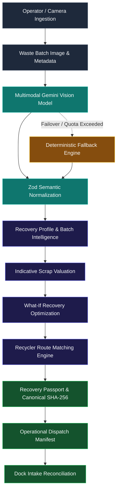

# RecycLens

> **AI-Powered Material Recovery Intelligence**
> *Turn a waste batch into an explainable recovery decision.*

[](https://www.typescriptlang.org/)
[](https://react.dev/)
[](https://vitejs.dev/)
[](https://nodejs.org/)
[](https://ai.google.dev/)
[](https://zod.dev/)
[](https://tailwindcss.com/)

---

## The Recovery Decision Thesis

```
SCAN → UNDERSTAND → VALUE → OPTIMIZE → ROUTE → PASSPORT → DISPATCH → RECONCILE
```

### Why Waste Recognition Is Not Enough

Traditional computer vision applications in waste management typically stop at classification: **"What is this material?"** They output a label (such as `Plastic Bottle` or `Cardboard Box`) with a percentage score.

In actual waste recovery and material recovery facilities (MRFs), a classification label alone cannot answer operational questions:
* **What is the real condition of the batch?** Is it clean, grease-soaked, filled with liquid, or bound with non-recyclable adhesives?
* **What is the multi-material composition?** A scrap pile is rarely homogeneous. It contains primary streams, secondary fractions (e.g., closures, labels, fasteners), and visually obscured or ambiguous fractions.
* **What is the economic reality?** What is the indicative scrap benchmark, and how severely does visible contamination deduct from realizable yield?
* **What should the operator physically do?** Does this batch justify manual segregation, de-capping, or liquid draining? Or would intervention cost more effort than the recovered value?
* **Where should it go?** Which local facility has matching equipment, contamination tolerances, and batch minimums? Should the batch be dispatched as a whole, or split into specialized streams?
* **What happened when it arrived?** Did the physical scale weight and dock inspection match what was projected from the pre-dispatch scan?

**RecycLens is built to bridge this operational gap.** It transitions the technology from a basic image classifier into an end-to-end **Material Recovery Decision Intelligence Engine**.

---

## Core Pipeline



### Pipeline Stages

1. **Image Ingestion:** High-resolution photo upload, live camera capture, or 1-click representative scrap presets with operator-specified batch mass (kg) and facility location.
2. **AI Recovery Analysis:** Multimodal inspection extracting primary material taxonomy, secondary materials, contamination indicators, recoverability grade, and explicit visual evidence.
3. **Multi-Material Batch Intelligence:** Surface-area visual share allocation across detected components, explicitly isolating an **unresolved fraction** when materials are obscured or ambiguous.
4. **Indicative Scrap Valuation:** Transparent pricing engine combining regional baseline scrap rates (Mumbai/MMR baseline), quality multipliers, and contamination penalty deductions.
5. **What-If Recovery Optimization:** Deterministic simulation of three practical intervention tiers (*Minimal Preparation*, *Recommended Preparation*, *Maximum Separation*), modeling projected contamination reductions, yield gains, and routing changes.
6. **Recycler Route Matching:** Multi-criteria scorecard evaluating material compatibility, batch quantity thresholds, contamination tolerances, and Haversine transit distance.
7. **Recovery Passport:** Creation of an operational digital passport bundling immutable evidence snapshots, selected scenario projections, and routing context with an operational canonical SHA-256 payload integrity check.
8. **Operational Dispatch Manifest:** Generation of a driver/dock-ready manifest containing itemized material breakdowns, safety handling precautions, and action checklists.
9. **Dock Intake Reconciliation:** Comparison between pre-dispatch modeled expectations and physical dock weighment, computing mass variance ($\Delta \text{kg}$), contamination delta ($\Delta \text{pp}$), disposition tracking, and realized economic variance.

---

## The Recovery Evidence Chain

Rather than presenting unexplained black-box AI scores, RecycLens enforces an auditable **Evidence Chain** connecting visual reality to physical actions:

```
IMAGE
  ↓
OBSERVED VISUAL FEATURES (Geometry, opacity, surface gloss, color, markings)
  ↓
MATERIAL HYPOTHESIS (Polymer/metal category + model confidence)
  ↓
CONTAMINATION EVIDENCE (Visible stains, food residue, non-target fasteners)
  ↓
RECOVERABILITY ASSESSMENT (Commercially viable grade: A/B/C/Reject)
  ↓
ECONOMIC IMPACT (Clean gross benchmark vs. contamination deduction)
  ↓
WHAT-IF ACTION (Specific interventions: de-cap, drain liquid, segregate)
  ↓
OPERATIONAL ROUTE (Single-facility, split-routing, or hazardous disposal)
```

### Data Provenance Architecture

To prevent misleading operators, every metric in the RecycLens interface displays an explicit **Data Origin Tag**:

| Data Origin | Meaning | Example Metric |
| :--- | :--- | :--- |
| **`OBSERVED`** | Directly detected visual features physically visible in the image. | Surface grease, liquid pooling, bottle closures, cardboard corrugation. |
| **`INFERRED`** | Model-estimated visual attributes and classifications derived from pixels. | Material category (`PLASTIC_PET`), visual share percentage (75%), contamination severity. |
| **`MODELED`** | Deterministic mathematical projections based on published scrap baselines and engineering assumptions. | Indicative net scrap value (₹349–₹420), what-if contamination reduction (-45%). |
| **`USER CONFIRMED`** | Physical inputs confirmed and recorded by a human operator or scale operator. | Scale weighment (12.2 kg), physical dock intake inspection, actual preparation status. |

---

## Key Implemented Features

### 1. AI Recovery Profile & Evidence Inspection
* **Fine-Grained Classification:** Maps scrap across core industrial categories (`PLASTIC`, `PAPER`, `METAL`, `GLASS`, `EWASTE`, `TEXTILE`, `ORGANIC`, `OTHER`).
* **Visual Evidence Lists:** Exposes exact visual indicators cited by the model (e.g., *"Clear bottle finish with visible injection neck seam"*).
* **Contamination Severity Grading:** Assesses dirt, moisture, food residues, and foreign materials with qualitative severity levels (`CLEAN`, `LOW`, `MODERATE`, `HIGH`, `CRITICAL`).
* **Recoverability Score:** Models commercial reprocessability (0–100) and assigns an actionable grade (`GRADE_A`, `GRADE_B`, `GRADE_C`, `REJECT`).
* **Explicit Uncertainty:** Lists unconfirmed variables (e.g., *"Polymer resin code cannot be confirmed without spectroscopic verification"*).

### 2. Multi-Material Batch Intelligence
* **Component Composition Breakdown:** Identifies distinct material streams within a single image and allocates approximate visual surface shares.
* **Unresolved Fraction Accounting:** Avoids artificial 100% certainty; shadowed or unidentifiable debris is classified into an unresolved pool carrying a ₹0 baseline valuation.
* **Batch Recovery Synthesis:** Generates a batch archetype summary, condition assessment, and strategic routing recommendation (`SINGLE_FACILITY`, `SPLIT_ROUTING`, `SPECIALIZED_DISPOSAL`).

### 3. Indicative Scrap Valuation
* **Baseline Scrap Rates:** Configured regional market rate benchmarks reflecting Indian municipal scrap clusters (Mumbai/MMR Q3 2026 baseline in ₹/kg).
* **Transparent Deduction Engine:** Displays gross clean benchmark, contamination monetary deductions, and net realizable recovery value ranges.
* **Illustrative Allocation Disclosure:** Explicitly labels multi-material weight allocations as illustrative projections derived from visual share percentages.

### 4. What-If Recovery Optimization
* **Three Scenario Tiers:**
  1. *Minimal Preparation (Low Effort):* High-impact basic actions (e.g., gross dry-shake, simple gravity draining).
  2. *Recommended Preparation (Medium Effort):* Balanced interventions capturing maximum economic margin (e.g., manual de-capping, label stripping).
  3. *Maximum Separation (High Effort):* Complete fraction segregation for split-facility dispatch (e.g., isolating aluminium UBC cans or PCB heat sinks).
* **Deterministic Modeling Matrix:** Applies strict engineering boundaries (2.0% contamination floor, 98.0 recoverability ceiling, 5.0% intervention suppression heuristic).
* **Material Compatibility Safeguards:** Hard-coded physical rules preventing impossible or destructive recommendations:
  * *E-Waste:* Aqueous washing and hydraulic compaction are strictly blocked.
  * *Paper / Cardboard:* Aqueous washing and liquid draining are strictly blocked.
  * *Glass:* Baler compaction is strictly blocked.

### 5. Recovery Passport & Canonical Integrity
* **CSPRNG Identity:** Generates unique passport identifiers (`RCP-YYYY-<16 HEX>`) using 64-bit cryptographic entropy.
* **Source-Isolated Snapshots:** Freezes an operational snapshot of the evidence chain, weight provenance, operator verification, selected scenario, and routing context.
* **Deterministic Canonical Hashing:** Implements recursive UTF-16 lexicographical object sorting and numeric normalization to compute a canonical SHA-256 hash.
* **Tamper Detection:** Automatically flags payload modifications if any hashed field (contamination, routing, scenario, weight) is altered.

### 6. Operational Dispatch Manifest
* **Driver & Dock Handover:** Formats pre-dispatch instructions into an operational document (`DSP-YYYY-<16 HEX>`).
* **Stream-by-Stream Weight Estimates:** Translates visual percentages into indicative kg estimates based on batch mass.
* **Preparation Checklist & Safety Precautions:** Translates scenario actions and material risks into operational safety steps (e.g., ESD containment, moisture barriers, aerosol warnings).

### 7. Dock Intake Reconciliation
* **Physical vs. Modeled Comparison:** Records actual scale weight and dock inspection at receiving facilities (`REC-YYYY-<16 HEX>`).
* **Variance Analytics:** Computes weight variance ($\Delta \text{kg}$, percentage variance), contamination point delta ($\Delta \text{pp}$), and fractional acceptance/rejection counts.
* **Economic Realization:** Recalculates realizable value based on physical scale weight and actual dock condition, comparing it against the pre-dispatch projection.
* **Passport Verification Gate:** Evaluates passport integrity at intake, alerting dock staff if the incoming passport payload has been modified or corrupted.

---

## System Architecture

### Component Hierarchy

```
RECYCLENS
├── Frontend (React 18 + Vite + Tailwind CSS)
│   ├── Step 1: Scan & Ingestion HUD (ImageDropzone, CameraCapture, PresetSelector, WeightInputs)
│   ├── Step 2: AI Recovery Profile (ProfileCard, ContaminationGauge, CompositionBreakdown, ReasoningBox)
│   ├── Step 3: Scrap Valuation & Optimization (ValuationCard, RecoveryOptimizationSection, ScenarioComparison)
│   ├── Step 4: Facility Routing (RecyclerList, ExplainableRadarModal, DispatchModal)
│   ├── Step 5: Recovery Passport & Manifest (RecoveryPassportView, DispatchManifestCard)
│   └── Step 6: Dock Intake Reconciliation (DockReconciliationView, VarianceCards, DispositionTracker)
│
└── Backend (Node.js + Express + TypeScript)
    ├── Controllers (scan, match, rates, passport, dispatch, reconciliation, feedback)
    ├── Services
    │   ├── ai-vision.service.ts       # Multimodal Gemini API, Prompting, Model Cascade
    │   ├── fallback.service.ts        # Deterministic Offline Fallback Archetypes
    │   ├── valuation.service.ts       # Scrap Valuation & Multi-Material Benchmark Engine
    │   ├── matching.service.ts        # Recycler Scorecard & Split-Routing Engine
    │   ├── optimization.service.ts    # Deterministic What-If Scenario Modeling
    │   ├── passport.service.ts        # Canonical JSON Serialization & SHA-256 Hashing
    │   ├── dispatch.service.ts        # Operational Manifest & Safety Precautions
    │   └── reconciliation.service.ts  # Dock Variance & Intake Realization Analytics
    ├── Validation (Zod Schemas for all inputs and domain boundaries)
    └── Seed Data (presets, regional scrap rates, facility listings)
```

---

## Tech Stack

| Layer | Technology | Version | Purpose |
| :--- | :--- | :--- | :--- |
| **Frontend Framework** | React | `^18.3.1` | Declarative UI rendering & state management |
| **Build & Tooling** | Vite | `^5.4.11` | Hot module replacement & fast production bundling |
| **Language** | TypeScript | `^5.6.3` | End-to-end static typing across frontend and backend |
| **State Management** | Zustand | `^4.5.5` | Lightweight reactive store coordinating pipeline steps |
| **Styling** | Tailwind CSS | `^3.4.16` | Industrial HUD dark theme with responsive layout |
| **Server Framework** | Express | `^4.21.2` | RESTful API server handling processing requests |
| **Runtime & Execution** | Node.js / `tsx` | `^4.19.2` | Direct execution of TypeScript on server without separate compilation |
| **AI Vision API** | `@google/generative-ai` | `^0.21.0` | Official client library for Google Gemini multimodal models |
| **Schema Validation** | Zod | `^3.24.1` | Strict runtime boundary validation & defense against malformed inputs |
| **Icons & Micro-interactions** | `lucide-react` / `canvas-confetti` | `^0.468.0` / `^1.9.4` | UI status indicators and completion feedback |
| **Testing** | Node.js Built-in Test Runner (`--test`) | Node 20+ | Fast execution of 133 unit and integration tests |

---

## AI Architecture & Failure Resilience

RecycLens utilizes commercial multimodal vision models via the Google Gemini API. **We do not claim to train a custom foundation model.** The engineering novelty lies in structured prompt orchestration, strict runtime schema enforcement, and multi-tier failure resilience.

### Model Cascade Architecture

When an image is submitted, `ai-vision.service.ts` attempts generation across a prioritized model cascade with strict execution budgets:

```
1. gemini-3.8-flash (Primary candidate)
   ↓ (If 429 quota, 503 high-demand, or timeout)
2. gemini-3-flash-preview (Secondary failover)
   ↓ (If unavailable)
3. gemini-3.6-flash (Tertiary failover)
   ↓ (If unavailable)
4. gemini-3.1-flash-lite (Quaternary failover)
   ↓ (If all candidates exhausted or offline)
5. Deterministic Fallback Engine (Zero downtime offline archetypes)
```

### Why Deterministic Fallback Exists

In industrial waste environments, connectivity can be intermittent and cloud API quotas may be exceeded. The deterministic fallback engine (`fallback.service.ts`) ensures that:
1. The operational workflow never crashes on external network failures.
2. Operators can test and demonstrate the entire 6-stage lifecycle using verified presets.
3. Every fallback output is explicitly labeled with `is_fallback_inference: true` so simulated data is never mistaken for live model output.

---

## Security & Trust Model

RecycLens implements defensive engineering across every endpoint:

* **Zod Boundary Defense:** All incoming JSON payloads are validated against strict Zod schemas. Non-finite numbers (`NaN`, `Infinity`), negative weights, oversized strings, and unsupported material codes are rejected with HTTP 400.
* **Payload Size Limits:** Express body parsers enforce a 10MB limit; base64 image strings are validated with regex and capped at 25MB.
* **Array Bound Constraints:** Composition arrays are capped at 20 components; preparation actions and checklist items are strictly bounded to prevent memory exhaustion.
* **Rate Limiting:** Built-in in-memory rate limiter caps scan requests to 20 requests/minute/IP.
* **Error Sanitization:** API error handlers log diagnostics internally but emit sanitized JSON messages (`{ error: ... }`) without exposing server stack traces or environment variables.
* **Canonical SHA-256 Integrity:** Recovery Passports compute a deterministic SHA-256 hash over canonical JSON. Any modification to the payload invalidates the hash.

### Explicit Trust Boundaries

To maintain technical and commercial credibility, RecycLens explicitly documents what its cryptographic and modeling mechanisms **can** and **cannot** do:

> [!IMPORTANT]
> **What RecycLens Verifies:**
> * RecycLens verifies the internal consistency and tamper-evidence of a supplied passport payload via canonical SHA-256 hashing.
> * It verifies whether an incoming record matches its creation snapshot without alteration.
>
> **What RecycLens DOES NOT Claim:**
> * **Not Legal Custody:** RecycLens is an operational software tool, not a legal transfer of custody or bill of lading.
> * **Not Financial Settlement:** Valuations and variances are indicative decision aids, not certified financial settlement invoices.
> * **Not Physical Certification:** Visual inspection cannot certify physical scale mass, laboratory chemical purity, or absence of internal hazardous substances.
> * **Not Operator Authentication:** The SHA-256 hash provides tamper-evidence against uncoordinated modification; it is not a cryptographic non-repudiation signature or proof of human identity.

---

## Why RecycLens Is Different

| Dimension | Traditional Waste Classifier | Industrial Optical Sorter (e.g., Greyparrot, Recycleye) | RecycLens Material Recovery Intelligence |
| :--- | :--- | :--- | :--- |
| **Primary Scope** | Image label classification (Plastic/Paper/Metal) | High-speed conveyor belt belt-level robotic sorting | Decision intelligence, preparation economics & operational handoff |
| **Target User** | Consumer / Educational apps | Heavy MRF sorting plants | MRF supervisors, scrap aggregators, dock receiving managers |
| **Output** | Single category + confidence % | High-frequency actuator signals & conveyor telemetry | Multi-material profile, what-if preparation scenarios, route matching |
| **Economics** | None | Bulk mass estimates | Indicative scrap yield, contamination deductions, net recovery ranges |
| **Operational Chain** | Stops at detection | Stops at physical sorting bin | Connects Scan → Passport → Dispatch Manifest → Dock Reconciliation |
| **Hardware Barrier** | Smartphone camera only | Expensive specialized cameras & robotic arms ($$$) | Software-first: works with standard mobile/tablet cameras or CCTV feeds |

*Note: RecycLens does not compete with industrial optical sorters; it operates at a complementary product layer, providing decision support and auditable custody manifests for material batches.*

---

## Research Foundation

RecycLens is informed by published waste characterization datasets, industrial AI vision benchmarks, and official regulatory frameworks:

* **[TACO Dataset (Trash Annotations in Context)](https://arxiv.org/abs/2003.06975)** *(Proença & Simões, 2020)*
  *Context:* Highlighted the challenge of background clutter, variable lighting, and partial occlusions in real-world waste imagery, informing RecycLens's emphasis on explicit visual evidence and uncertainty reporting.
* **[Greyparrot AI](https://www.greyparrot.ai/)**
  *Context:* Industry pioneer demonstrating the commercial necessity of tracking 100% of material composition and contamination rather than single-object classification.
* **[Recycleye](https://recycleye.com/)**
  *Context:* Validated the combination of computer vision and operational material tracking to improve recycling facility economics.
* **[CPCB Plastic Waste Management Rules & EPR Guidelines (India)](https://cpcb.nic.in/)**
  *Context:* Provided the regulatory framework for categorizing plastics into Category I (Rigid), Category II (Flexible/Film), and Category III (Multi-layered), directly shaping our material code taxonomy and scrap pricing benchmarks.

---

## Current Implementation Status

Verified against the release gate at commit `c3ac8a7b151307c0b3ebc35a22ca915c79901e55` on branch `main`:

* **Unit & Integration Tests:** **133 / 133 passed (100%)**
* **Project Regression Matrix:** **20 / 20 scenarios passed (100%)**
* **Master API Smoke Suite:** **15 / 15 checks passed (100%)**
* **TypeScript Compilation:** **Clean (0 errors via `npx tsc --noEmit`)**
* **Production Build:** **Clean (Vite v5.4.11 production bundle built in 2.4s)**
* **Git Synchronization:** **`HEAD == origin/main`**

---

## Interactive Demo Flow (6-Screen Walkthrough)

1. **Step 1: Scan HUD (`/`)**
   * Select a test preset (e.g., *Clear PET Beverage Bottles* or *Contaminated Cardboard Packaging*) or upload a custom scrap image.
   * Adjust estimated batch weight (e.g., 12.5 kg) and facility location.
   * Click **Run Material Recovery Intelligence**.
2. **Step 2: Understand — AI Recovery Profile**
   * Review primary material identification, model confidence, and visual reasoning.
   * Inspect the multi-component composition breakdown and unresolved fraction.
   * Examine contamination severity gauge and cited visual evidence indicators.
3. **Step 3: Value & Optimize — Scrap Economics**
   * Inspect the indicative scrap valuation breakdown (gross clean benchmark vs. contamination deduction).
   * Review the three What-If Optimization Scenarios (*Minimal*, *Recommended*, *Maximum Separation*).
   * Compare projected contamination reductions and net value improvements in the comparison matrix.
4. **Step 4: Route — Recycler Matching**
   * Review matched regional reprocessors ranked by compatibility scorecard.
   * Inspect split-routing recommendations for separable multi-material batches.
   * Open the Explainable Radar Modal to view multi-attribute matching scores.
5. **Step 5: Passport & Dispatch — Operational Record**
   * View the generated **Batch Recovery Passport** (`RCP-YYYY-...`) with its verified SHA-256 canonical hash.
   * Inspect the scenario-aware **Recovery Dispatch Manifest** (`DSP-YYYY-...`), material breakdown, handling precautions, and preparation checklist.
6. **Step 6: Reconcile — Dock Intake Verification**
   * Simulate receiving dock weighment and operator inspection.
   * Submit intake record to generate an **Intake Reconciliation Report** (`REC-YYYY-...`).
   * Review mass variance ($\Delta \text{kg}$), contamination point delta, accepted/rejected fractions, realized economics, and passport integrity verification status.

---

## Repository Structure

```
RECYCLENS/
├── package.json                 # Project configuration, scripts, and dependencies
├── tsconfig.json                # TypeScript compiler configuration
├── vite.config.ts               # Vite bundler configuration
├── tailwind.config.js           # Tailwind CSS theme tokens & HUD styles
│
├── src/                         # Frontend Application Source
│   ├── App.tsx                  # Top-level screen coordinator (Steps 1–6)
│   ├── main.tsx                 # React DOM entry point
│   ├── index.css                # Global CSS, HUD grid animations, scrollbars
│   ├── store/
│   │   └── useRecyclensStore.ts # Zustand global state store & API actions
│   ├── types/
│   │   └── recyclens.types.ts   # Core TypeScript domain interfaces
│   ├── utils/
│   │   └── api.ts               # Typed frontend HTTP client
│   └── components/
│       ├── common/              # StepIndicator, LoadingHUD
│       ├── layout/              # Navbar, TopbarHUD
│       ├── scan/                # ImageDropzone, CameraCapture, PresetSelector, WeightInputs
│       ├── profile/             # RecoveryProfileCard, ContaminationGauge, CompositionBreakdown
│       ├── valuation/           # ValuationCard, ContaminationPenaltyBar, PriceDisclaimer
│       ├── optimization/        # RecoveryOptimizationSection, ScenarioComparisonTable
│       ├── routing/             # RecyclerList, RecyclerCard, ExplainableRadarModal, DispatchModal
│       ├── passport/            # RecoveryPassportView (Snapshot & SHA-256 integrity display)
│       ├── dispatch/            # DispatchManifestCard (Itemized checklist & precautions)
│       └── reconciliation/      # DockReconciliationView (Intake form, variance cards, report)
│
├── server/                      # Backend API Server Source
│   ├── index.ts                 # Express server bootstrap & middleware
│   ├── controllers/             # Request handlers (scan, match, rates, passport, dispatch, recon)
│   ├── services/
│   │   ├── ai-vision.service.ts # Google Generative AI integration, prompt, model cascade
│   │   ├── fallback.service.ts  # Deterministic offline fallback intelligence
│   │   ├── valuation.service.ts # Scrap rate valuation & component breakdown
│   │   ├── matching.service.ts  # Recycler matching scorecard & split routing
│   │   ├── optimization.service.ts # Phase 4 what-if scenario optimization
│   │   ├── passport.service.ts  # Phase 5.1 recovery passport & canonical SHA-256
│   │   ├── dispatch.service.ts  # Phase 5.2 dispatch manifest generation
│   │   └── reconciliation.service.ts # Phase 5.3 dock intake reconciliation
│   ├── routes/
│   │   └── api.routes.ts        # Express REST route definitions
│   ├── data/                    # JSON seed datasets (presets, rates, recyclers)
│   └── tests/                   # 133 comprehensive unit and integration tests
│
└── scratch/                     # Untracked development & test scripts
```

---

## Local Development Setup

### Prerequisites
* **Node.js:** v18.0.0 or higher (v20+ recommended)
* **npm:** v9.0.0 or higher
* **Google Gemini API Key:** (Optional for live AI vision; deterministic fallback operates automatically if absent)

### Installation

1. **Clone the repository:**
   ```bash
   git clone https://github.com/HenilLol/Recyclens.git
   cd Recyclens
   ```

2. **Install dependencies:**
   ```bash
   npm install
   ```

3. **Configure environment:**
   Create a `.env` file in the root directory:
   ```env
   PORT=5000
   GEMINI_API_KEY=your_gemini_api_key_here
   GEMINI_MODEL=gemini-3.8-flash
   ```
   *(If `GEMINI_API_KEY` is omitted, the server automatically routes requests to the deterministic fallback engine with full pipeline capability).*

4. **Start the development servers:**
   ```bash
   # Run both frontend (port 5173) and backend (port 5000) concurrently:
   npm run dev
   ```
   Or run them in separate terminals:
   ```bash
   npm run dev:backend   # Express API server with auto-reload (port 5000)
   npm run dev:frontend  # Vite development server (port 5173)
   ```

5. **Access the application:**
   Open your browser to `http://localhost:5173`.

---

## Verification & Testing

All verification commands are executable directly from the repository root:

```bash
# 1. Run full unit and integration test suite (133 tests):
npm test

# 2. Run TypeScript static type checker (0 errors):
npx tsc --noEmit

# 3. Build production bundle (Vite + TS):
npm run build

# 4. Run master live API smoke suite (15 checks):
# (Requires server running in background via `npm run start`)
node scratch/api_smoke_suite.js

# 5. Run full 20-scenario regression matrix:
npx tsx scratch/test_20_regression_matrix.js
```

---

## Future Roadmap

The following capabilities represent planned future phases and are **not claimed as currently implemented**:

* **Phase A: Field Pilot Deployment:** Deployment across pilot waste recovery centers to evaluate UI readability in outdoor daylight conditions.
* **Phase B: Real Operator Intake Dataset:** Aggregating anonymous, operator-confirmed dock intake variance records to establish real-world loss distributions.
* **Phase C: Weighbridge / Scale IoT Integration:** Direct hardware integration with digital scale indicators via RS-232/Bluetooth to automatically populate `USER_CONFIRMED` weights.
* **Phase D: MRF ERP & Transport Integration:** Direct export of dispatch manifests into logistics management systems and e-way bill portals.
* **Phase E: Longitudinal Facility Analytics:** Dashboards tracking historical supplier contamination trends, supplier grading, and material yield over time.
* **Phase F: Closed-Loop Model Calibration:** Utilizing historical dock reconciliation variance records to fine-tune regional recovery coefficients.

---

## Responsible AI & Operational Limitations

1. **Image $\neq$ Physical Weight:** An optical photograph cannot measure mass. All scrap valuations and dispatch breakdowns depend on the user-supplied or scale-measured batch weight.
2. **Visual Share $\neq$ Mass Share:** Visual surface percentages are geometric estimates. A dense metallic component occupying 10% visual share may constitute 40% of physical mass.
3. **Indicative Benchmark $\neq$ Guaranteed Spot Price:** Scrap rates represent indicative regional benchmarks and do not constitute binding purchase offers or settlement contracts.
4. **AI Inference Is Probabilistic:** Computer vision models can misidentify polymer subtypes, fail to detect internal moisture, or miss hidden contaminants. Human review remains essential.
5. **Modeled Scenarios $\neq$ Guaranteed Post-Treatment Outcomes:** What-if preparation projections are mathematical simulations based on defined scenario coefficients, not empirical laboratory measurements of treated batches.

---

## Why This Matters

> *"Waste recognition is only the beginning. The harder problem is deciding what should happen next.*
>
> *RecycLens connects visual evidence, material condition, economics, preparation actions, facility routing, and physical intake into one explainable, auditable recovery decision workflow."*

---

## License

This project is developed for hackathon demonstration and technical review. See repository license details.
